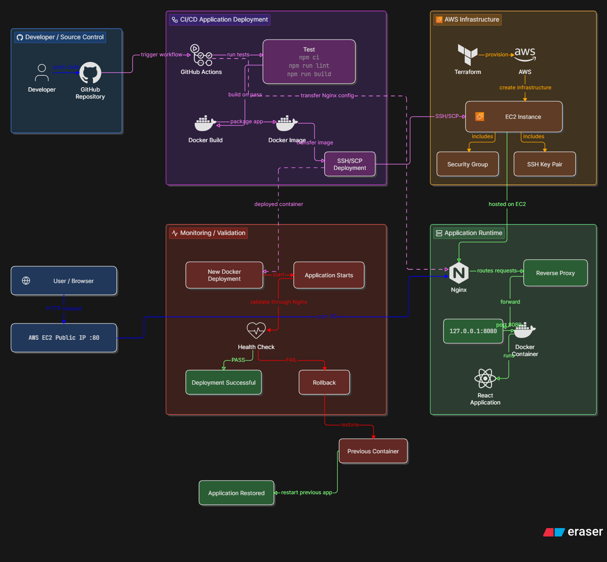

# React Application Deployment — AWS, Docker, Terraform & CI/CD


> End-to-end DevOps deployment of a containerized React application on AWS EC2 using Terraform, Docker, Nginx, and GitHub Actions.

---

## Live Demo

**Application:** [Open Live Application](http://43.204.101.177)

**Repository:** [react-devops-assessment](https://github.com/Divyansh-77/react-devops-assessment)

---

## Architecture

<p align="center">
  
</p>

```text
Developer
    |
    v
GitHub Repository
    |
    v
GitHub Actions
    |
    +--> Test
    |      |
    |      +--> npm ci
    |      +--> npm run lint
    |      +--> npm run build
    |
    +--> Docker Build
           |
           v
       AWS EC2
           |
           v
         Nginx :80
           |
           v
    Docker :127.0.0.1:8080
           |
           v
     React Application

Terraform is used separately to provision and manage the AWS infrastructure.

Technology Stack
Technology	Purpose
React	Frontend application
Docker	Application containerization
Terraform	Infrastructure as Code
AWS EC2	Application server
Nginx	Reverse proxy
GitHub Actions	CI/CD automation
GitHub	Source control
SSH/SCP	Deployment communication
Repository Structure
react-devops-assessment/
├── src/
├── deploy/
│   └── nginx.conf
├── terraform/
├── .github/
│   └── workflows/
│       └── ci.yml
├── docs/
│   └── architecture.png
├── Dockerfile
├── package.json
├── package-lock.json
└── README.md
Infrastructure with Terraform

Terraform provisions the AWS resources required for the application:

EC2 instance
Security group
SSH key pair
EC2 initialization

Instance initialization installs and starts Docker and Nginx.

terraform -chdir=terraform init
terraform -chdir=terraform plan
terraform -chdir=terraform apply
Docker

The application uses a multi-stage Docker build.

Build stage

Node.js
Dependency installation
React production build

Runtime stage

Nginx Alpine
Serves the generated dist files
Exposes port 80

This keeps the production image focused on application runtime rather than the build environment.

Nginx

Nginx runs on the EC2 host and provides the public HTTP entry point.

Internet
   |
   v
Nginx :80
   |
   v
127.0.0.1:8080
   |
   v
Docker Container :80
   |
   v
React Application

The Docker container is not directly exposed to the internet.

CI/CD

A push to main triggers the GitHub Actions pipeline:

Push to main
     |
     v
Install Dependencies
     |
     v
Lint
     |
     v
React Build
     |
     v
Docker Image Build
     |
     v
SSH / SCP to EC2
     |
     v
Container Deployment
     |
     v
Health Check
     |
     +---- PASS ----> Success
     |
     +---- FAIL ----> Rollback
Test
npm ci
npm run lint
npm run build
Deployment

After tests pass, the workflow:

Builds the Docker image.
Tags the image with the Git commit SHA.
Transfers the image to EC2.
Loads the image into Docker.
Starts the new container.
Validates the application.
Rolls back if validation fails.
Health Check

The deployment validates the application through Nginx:

curl --fail --silent --show-error http://127.0.0.1/

A deployment is considered successful only when the health check passes.

Rollback

Before deploying a new version, the previous container is preserved as react-app-previous.

If the new deployment fails its health check:

New Version
    |
    v
Health Check
    |
    X
    |
    v
Rollback
    |
    v
Previous Version

The rollback mechanism was validated using an intentionally broken deployment. The failed deployment triggered the rollback and restored the previous working version.

Security
Secrets are stored in GitHub Actions Secrets.
SSH private keys are not committed to the repository.
The application container is bound to 127.0.0.1:8080.
Nginx is the public HTTP entry point.
AWS access should follow least-privilege principles.
SSH access is configured for CI/CD connectivity in this assessment environment.
Deployment

Push changes to main:

git add .
git commit -m "update application"
git push origin main

GitHub Actions then performs testing, Docker build, deployment, and health validation automatically.

Cleanup

The assessment infrastructure can be removed with:

terraform -chdir=terraform destroy

This prevents unnecessary ongoing AWS costs after the review.

Production Considerations

For a production environment, the setup could be extended with:

HTTPS/TLS
Restricted SSH/network access
Centralized logging
Monitoring and alerting
Stronger IAM controls
Additional security and scalability measures
Conclusion

This project demonstrates a complete DevOps workflow:

Terraform → AWS EC2 → Docker → Nginx → GitHub Actions → Health Check → Rollback

It provides reproducible infrastructure, automated deployment, containerized application delivery, deployment validation, and failure recovery.